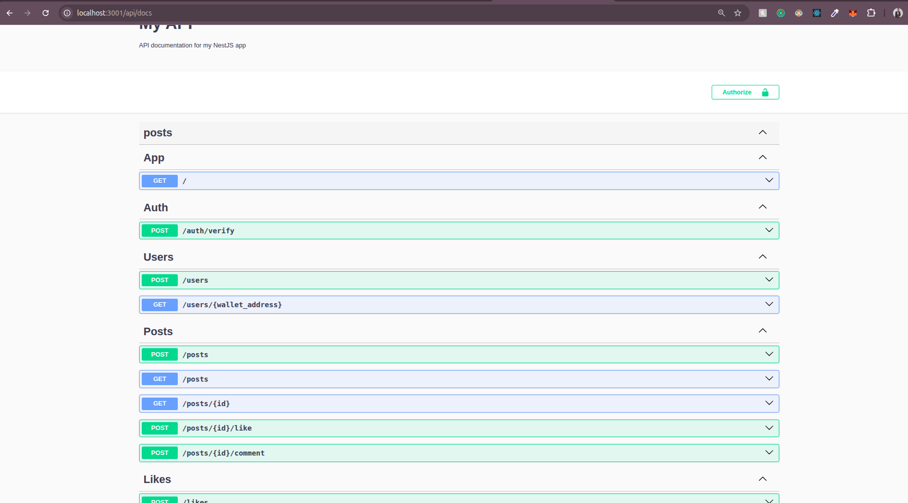

## Description

[Nest](https://github.com/nestjs/nest) framework TypeScript starter repository.

## Project setup

```bash
$ yarn
```

## Compile and run the project

```bash
# development
$ yarn run start

# watch mode
$ yarn run start:dev

# production mode
$ yarn run start:prod
```
### Create .env file using .env.example file


## API Documentation (Swagger)
```bash
http://localhost:3000/api/docs

```
## Database Migrations

```bash
yarn run migration:generate

yarn run migration:run

```
To revert the last miggration
```bash
yarn run migration:revert
```

## Technologies Used
NestJS – Backend framework

TypeORM – ORM for PostgreSQL

PostgreSQL – Database

Swagger – API documentation

class-validator – Request validation

dotenv – Environment management


## Screen Shots

