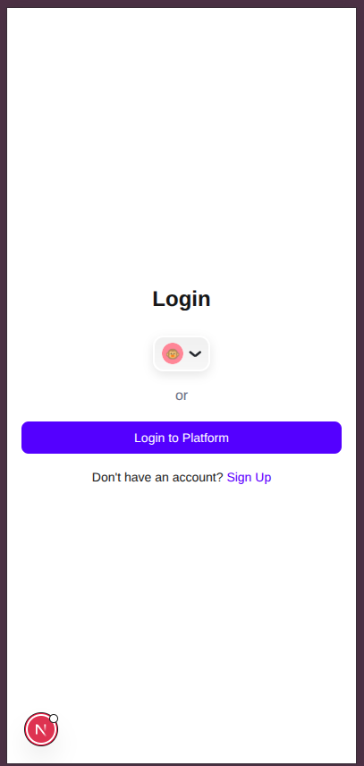
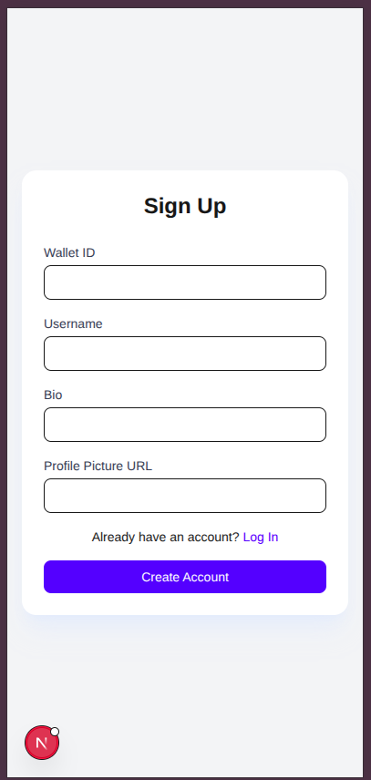
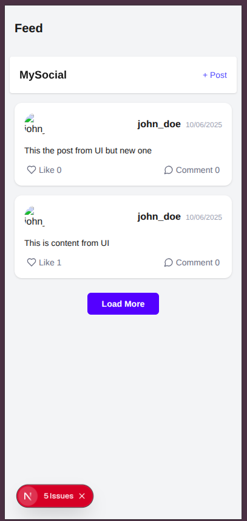
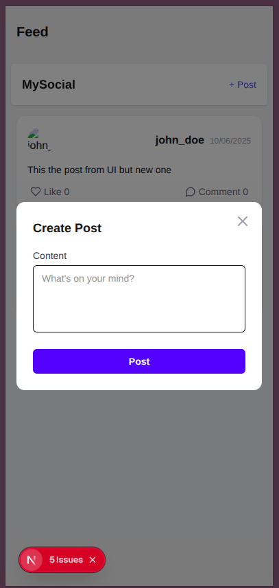

# ⚡ Next.js 15 App – Modern Web Application

A fast, responsive, and scalable web application built with **Next.js 15 App Router** and **Tailwind CSS**. This project showcases a modular frontend architecture with support for modern tooling, optional wallet-based authentication, and dynamic content rendering.

---

## Getting Started
First, install the dependencies

```bash
yarn 
```
Second, Create .env file using .env.example file

Third, run the development server:
```bash
yarn dev
```

Open [http://localhost:3000](http://localhost:3000) with your browser to see the result.


## Technologies Used

Framework: Next.js 15 (App Router)

Styling: Tailwind CSS

Typescript: Type-safe development

Icons: Lucide 

Authentication: [RainbowKit + Wagmi + Ethers.js] 

API: REST API  


## Scereen shot






